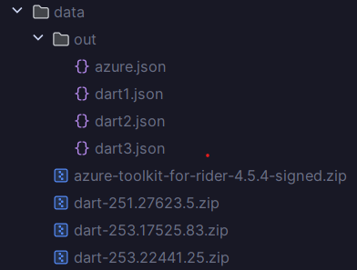

# 🔬 Plugin DNA Verifier (ASM + MinHash LSH)

A tool for **fingerprinting plugin JARs/ZIPs** using [ASM](https://asm.ow2.io/) for bytecode parsing and **MinHash LSH** for efficient similarity detection.

It supports:
- **One-to-One comparison** → Compare two plugin builds and measure similarity.
- **One-to-Many comparison** → Detect potential matches in a larger collection efficiently, simulating real-world plugin verification.

---

## 📂 Project Structure

- **`Main.kt`** → Entry point. Dispatches commands (`tokenize`, `compare`, `compare-many`).
- **`DNA.kt`** → Abstract representation of a plugin’s "DNA" (classes, methods, fields, packages, etc.).
- **`ZipDNA`** → Tokenizes a plugin ZIP/JAR:
    - Extracts entries
    - Parses `.class` files with ASM
    - Collects classes, fields, and methods
    - Runs **MinHash** and stores signatures into LSH buckets
    - Outputs a DNA JSON fingerprint
- **`CompareOneToOneDNA`** → Compares two DNA JSON files and produces similarity metrics.
- **`CompareOneToManyDNA`** → Compares one DNA JSON against many using LSH buckets. Optimizes comparison from **O(n)** to **O(k)**, where *k* is the number of candidates in the same buckets.
- **`Global`** → Stores IDs of all DNA and a global bucket → DNA index (naive in-memory "database").
- **`Utils`** → Shared helper functions.

---

## 🚀 Usage

Download the standalone **shadow JAR** (`dna`) from [Releases](./releases).

Run with:

```bash
# Tokenize a plugin JAR/ZIP into a DNA JSON
dna tokenize <zipPath> <outJson>

# Compare two DNA JSONs (one-to-one)
dna compare <json1> <json2>

# Compare a DNA JSON against all others in Global.json (one-to-many)
dna compare-many <jsonPath>
```

---

## Demo 

Downloaded 4 different zip plugin files from the Jetbrains market place 
- [Azure Toolkit For Rider-4.5.4](https://plugins.jetbrains.com/plugin/11220-azure-toolkit-for-rider)
- [Dart-251.27623.5](https://plugins.jetbrains.com/plugin/6351-dart/versions/stable/794632)
- [Dart-253.17525.83](https://plugins.jetbrains.com/plugin/6351-dart/versions/stable/855273)
- [Dart-253.22441.24](https://plugins.jetbrains.com/plugin/6351-dart/versions/stable/865606)

Ran my tokeniser using the following commands 
```bash
 > $jarPath = ".\build\libs\dna-1.0-SNAPSHOT-all.jar"
 > java -jar $jarPath
   Usage:
    dna tokenize <zipPath> <outJson>
    dna compare <json1> <json2>
    dna compare-many <jsonPath>
 > java -jar $jarPath tokenize .\data\azure-toolkit-for-rider-4.5.4-signed.zip .\data\out\azure.json
    DNA written to .\data\out\azure.json
 > java -jar $jarPath tokenize .\data\dart-251.27623.5.zip .\data\out\dart1.json
    DNA written to .\data\out\dart1.json
 > java -jar $jarPath tokenize .\data\dart-253.17525.83.zip .\data\out\dart2.json
    DNA written to .\data\out\dart2.json
 > java -jar $jarPath tokenize .\data\dart-253.22441.25.zip .\data\out\dart3.json
    DNA written to .\data\out\dart3.json
```

So now we have each file with its own .json and each .json contains information about the zip folder including id, buckets, class names, method names, field names, and file properties.


Now running the one to one comparison between azure and dart we get
```bash
> java -jar $jarPath compare .\data\out\azure.json .\data\out\dart1.json
  Comparison Result with dart-251.27623.5

  Classes
   Common: 0
   Unique (Project 1): 64190
   Unique (Project 2): 1654

  Methods
   Common: 680
   Unique (Project 1): 108941
   Unique (Project 2): 3457

  Fields
   Common: 479
   Unique (Project 1): 77333
   Unique (Project 2): 1753

  Packages
   Common: 0

  Files
   Common: 1

  Similarity Scores
   Classes: 0.00%
   Methods: 0.60%
   Fields:  0.60%
   Overall: 0.15%
```

And running it between dart-253.17524.83 and dart-252.22441.25 we get
```bash
> java -jar $jarPath compare .\data\out\dart2.json .\data\out\dart3.json
  Comparison Result with dart-253.22441.25

  Classes
   Common: 1647
   Unique (Project 1): 1
   Unique (Project 2): 0

  Methods
   Common: 4132
   Unique (Project 1): 0
   Unique (Project 2): 0

  Fields
   Common: 2228
   Unique (Project 1): 0
   Unique (Project 2): 0

  Packages
   Common: 92

  Files
   Common: 1747

  Similarity Scores
   Classes: 99.94%
   Methods: 100.00%
   Fields:  100.00%
   Overall: 99.56% 
```

Now running the one to many test for dart-253.22441.25 we get 
```bash
>  java -jar $jarPath compare-many .\data\out\dart3.json
Alert! Matches found! with the following plugins :
dart-251.27623.5
dart-253.17525.83
----------------
  Comparison Result with dart-251.27623.5

  Classes
   Common: 1647
   Unique (Project 1): 0
   Unique (Project 2): 7

  Methods
   Common: 4117
   Unique (Project 1): 15
   Unique (Project 2): 20

  Fields
   Common: 2225
   Unique (Project 1): 3
   Unique (Project 2): 7

  Packages
   Common: 92

  Files
   Common: 121

  Similarity Scores
   Classes: 99.58%
   Methods: 99.16%
   Fields:  99.55%
   Overall: 51.51%

  Comparison Result with dart-253.17525.83

  Classes
   Common: 1647
   Unique (Project 1): 0
   Unique (Project 2): 1

  Methods
   Common: 4132
   Unique (Project 1): 0
   Unique (Project 2): 0

  Fields
   Common: 2228
   Unique (Project 1): 0
   Unique (Project 2): 0

  Packages
   Common: 92

  Files
   Common: 1747

  Similarity Scores
   Classes: 99.94%
   Methods: 100.00%
   Fields:  100.00%
   Overall: 99.56%
```

And running one to many for Azure we get 
```bash
> java -jar $jarPath compare-many .\data\out\azure.json
No Matches Found! Good To Go! 
```
